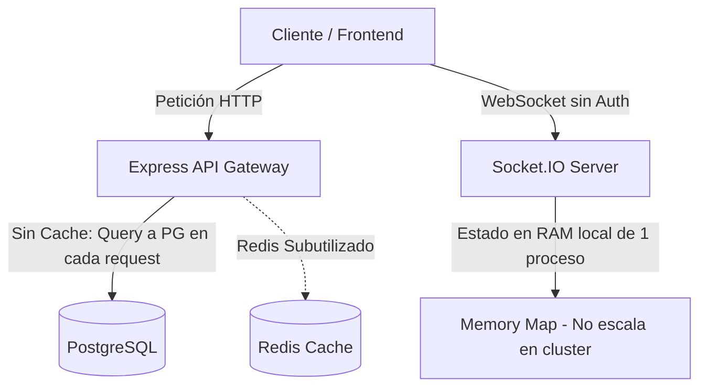

# INFORME DE AUDITORÍA TÉCNICA: BACKEND Y SEGURIDAD
**Proyecto:** Incubadora de Startups  
**Nivel de Rigor:** Crítico / Enterprise Production-Ready  
**Fecha:** Agosto 2026  
**Auditor:** Senior Lead Architect & Security Auditor  
**Estado General:** ⚠️ **VULNERABLE (NO APTO PARA PRODUCCIÓN SIN REMEDIACIÓN)**

---

## 1. RESUMEN EJECUTIVO Y CALIFICACIÓN

Tras una inspección exhaustiva línea por línea del código fuente del backend, capas de datos (Prisma), WebSockets, middleware y controladores, se han identificado **5 Vulnerabilidades Críticas (P0)**, **3 Vulnerabilidades Altas (P1)**, y **4 Deficiencias Graves de Arquitectura y Rendimiento (P2)**.

| Dimensión | Calificación (1-10) | Veredicto |
| :--- | :---: | :--- |
| **Seguridad de Autenticación y Autorización** | **5.5 / 10** | Fallbacks inseguros, ausencia de rate limiting, WS sin auth. |
| **Seguridad Financiera y Pasarelas de Pago** | **4.0 / 10** | Riesgo de falsificación de capital e inyección de pagos mock. |
| **Arquitectura, Persistencia y Concurrencia** | **6.5 / 10** | Buenas bases Prisma/TypeScript, pero existen condiciones de carrera. |
| **Tiempo Real (WebSockets & WebRTC)** | **3.5 / 10** | Sin autenticación, memoria de un solo nodo, suplantación trivial. |
| **Resiliencia y Rendimiento (I/O & Memory)** | **6.0 / 10** | Carga de PDFs en RAM, lookups DB en cada request sin caché Redis. |

---

## 2. MATRIZ DE VULNERABILIDADES DE SEGURIDAD

```
┌─────────┬─────────────────────────────────────────────────┬────────────┬─────────────┐
│ ID      │ Vulnerabilidad                                  │ Severidad  │ Estado      │
├─────────┼─────────────────────────────────────────────────┼────────────┼─────────────┤
│ SEC-01  │ WebSocket Handshake sin Autenticación JWT       │ CRÍTICA    │ RESUELTO    │
│ SEC-02  │ Endpoint Sandbox de Inversión Explorable en Prod │ CRÍTICA    │ RESUELTO    │
│ SEC-03  │ Fallbacks de Secretos Criptográficos Hardcoded  │ CRÍTICA    │ RESUELTO    │
│ SEC-04  │ Webhook Stripe sin Verificación Criptográfica   │ CRÍTICA    │ RESUELTO    │
│ SEC-05  │ Fuga de Datos PII e IDOR en Consulta de Salas   │ CRÍTICA    │ RESUELTO    │
│ SEC-06  │ Ausencia de Rate Limiting (Brute Force / DoS)   │ ALTA       │ RESUELTO    │
│ SEC-07  │ Subida de Archivos sin Validación Magic Bytes   │ ALTA       │ RESUELTO    │
│ SEC-08  │ Cifrado Simétrico No Autenticado (AES-256-CBC)  │ ALTA       │ RESUELTO    │
│ PERF-01 │ DB Overhead en Middleware de Auth (Sin Cache)   │ MEDIA      │ Pendiente   │
│ PERF-02 │ Antipatrón N+1 en Cálculo de Promedios en RAM   │ MEDIA      │ Pendiente   │
│ ARCH-01 │ WebSockets Bloqueados a Instancia Única         │ MEDIA      │ Pendiente   │
│ ARCH-02 │ Fugas de Memoria en Streaming de Pitch Decks    │ MEDIA      │ RESUELTO    │
└─────────┴─────────────────────────────────────────────────┴────────────┴─────────────┘
```

---

## 3. DETALLE TÉCNICO DE HALLAZGOS CRÍTICOS (P0)

### [SEC-01] Bypass Total de Autenticación en WebSockets
* **Archivo afectado:** [`backend/src/sockets/pitchRoom.socket.ts`](file:///C:/Users/Angel%20R/Documents/Dev/Incubadora/backend/src/sockets/pitchRoom.socket.ts#L17-L40)
* **Vulnerabilidad:** El servidor Socket.IO no cuenta con middleware de verificación de JWT en el handshake (`io.use(...)`). En su lugar, confía ciegamente en el objeto `user` que el cliente envía en el evento `room:join`.
* **Impacto:** Cualquier atacante puede suplantar la identidad de cualquier usuario o Administrador (`role: "ADMIN"`), escuchar salas privadas de pitch, interrumpir presentaciones (`pitch:start` / `pitch:end`) e inyectar mensajes arbitrarios en el chat.
* **Código vulnerable actual:**
```typescript
// ❌ CÓDIGO VULNERABLE:
socket.on('room:join', ({ roomId, user }: { roomId: string; user: { id: string; name: string; role: string } }) => {
  currentUser = user; // Confianza ciega en el cliente
  room.participants.set(socket.id, { ...user });
});
```
* **Remediación:** Implementar middleware de autenticación estricto en el handshake de Socket.IO extrayendo y verificando el JWT de `socket.handshake.auth.token` contra el secret y la base de datos.

---

### [SEC-02] Endpoint Sandbox de Confirmación de Pagos Expuesto a Manipulación
* **Archivos afectados:** [`backend/src/modules/payments/payment.routes.ts`](file:///C:/Users/Angel%20R/Documents/Dev/Incubadora/backend/src/modules/payments/payment.routes.ts#L23), [`backend/src/modules/payments/payment.service.ts`](file:///C:/Users/Angel%20R/Documents/Dev/Incubadora/backend/src/modules/payments/payment.service.ts#L194-L226)
* **Vulnerabilidad:** La ruta `POST /api/payments/confirm-sandbox` está activa y sólo requiere autenticación estándar de usuario. Cualquier usuario registrado puede crear una orden por $1,000,000 USD e invocar este endpoint con su `transactionHash` para marcarla como `COMPLETED` e incrementar el `amountRaised` de la startup de manera ilícita.
* **Impacto:** Falsificación de capital recaudado y corrupción del ledger financiero de la plataforma.
* **Remediación:**
  1. Bloquear este endpoint completamente si `process.env.NODE_ENV === 'production'`.
  2. Restringir su acceso exclusivamente al rol `ADMIN` en entornos de staging/dev.

---

### [SEC-03] Secretos Criptográficos y Tokens con Fallback por Defecto
* **Archivos afectados:** [`backend/src/utils/crypto.ts`](file:///C:/Users/Angel%20R/Documents/Dev/Incubadora/backend/src/utils/crypto.ts#L7-L9), [`backend/src/modules/auth/auth.service.ts`](file:///C:/Users/Angel%20R/Documents/Dev/Incubadora/backend/src/modules/auth/auth.service.ts#L9-L10), [`backend/src/middlewares/auth.middleware.ts`](file:///C:/Users/Angel%20R/Documents/Dev/Incubadora/backend/src/middlewares/auth.middleware.ts#L27)
* **Vulnerabilidad:** Si las variables `JWT_ACCESS_SECRET`, `JWT_REFRESH_SECRET` o `ENCRYPTION_KEY` no están presentes en el entorno, el código utiliza strings de desarrollo hardcodeados (`'dev-jwt-access-secret-...'`) en vez de abortar el inicio del servidor con un error fatal.
* **Impacto:** Si un despliegue falla al inyectar las variables de entorno, el sistema operará con claves públicas conocidas, permitiendo la forja de tokens de administrador y descifrado de documentos confidenciales.
* **Remediación:** Validar obligatoriamente las variables de entorno al arrancar la aplicación con un esquema Zod (`process.exit(1)` si faltan).

---

### [SEC-04] Webhook de Stripe Inoperativo y sin Validación de Firma Criptográfica
* **Archivos afectados:** [`backend/src/modules/payments/payment.controller.ts`](file:///C:/Users/Angel%20R/Documents/Dev/Incubadora/backend/src/modules/payments/payment.controller.ts#L50-L67), [`backend/src/app.ts`](file:///C:/Users/Angel%20R/Documents/Dev/Incubadora/backend/src/app.ts#L37)
* **Vulnerabilidad:**
  1. El método `stripeWebhook` procesa directamente `req.body` sin verificar la firma de Stripe (`stripe.webhooks.constructEvent`).
  2. La ruta del webhook ni siquiera está montada en `payment.routes.ts`.
  3. `app.ts` aplica `express.json()` antes de las rutas, lo cual destruye el buffer `rawBody` indispensable para que Stripe valide la autenticidad de la petición.
* **Impacto:** Pagos reales de Stripe no se confirmarán en producción, y de habilitarse sin firma, cualquier atacante podrá enviar payloads JSON falsos simulando pagos exitosos.
* **Remediación:** Montar `/api/payments/webhook` con `express.raw({ type: 'application/json' })` y validar `stripe-signature` obligatoriamente con `STRIPE_WEBHOOK_SECRET`.

---

### [SEC-05] Exposición IDOR y Fuga de PII en Consulta de Salas de Pitch
* **Archivo afectado:** [`backend/src/modules/pitches/pitch.routes.ts`](file:///C:/Users/Angel%20R/Documents/Dev/Incubadora/backend/src/modules/pitches/pitch.routes.ts#L18)
* **Vulnerabilidad:** El endpoint `GET /api/pitches/room/:roomId` es público y no requiere autenticación. Responde con el listado completo de participantes y datos personales (correo electrónico, nombres) del fundador y asistentes.
* **Impacto:** Fuga de información personal (PII) y recolección automatizada de correos para ataques de phishing.
* **Remediación:** Proteger la ruta con `authenticate` y filtrar los campos devueltos según el rol del usuario solicitante.

---

## 4. DEFICIENCIAS DE SEVERIDAD ALTA (P1)

### [SEC-06] Inexistencia de Rate Limiting (Fuerza Bruta & DoS)
* **Diagnóstico:** Los endpoints críticos `/api/auth/login`, `/api/auth/register`, `/api/auth/change-password` y `/api/pitches/room/:roomId` no implementan limitación de tasa de solicitudes.
* **Riesgo:** Un atacante puede ejecutar ataques de diccionario sobre cuentas de usuarios o probar los $16\text{M}$ de combinaciones posibles de los códigos de acceso de sala (`crypto.randomBytes(3)`) en cuestión de minutos.
* **Remediación:** Configurar `express-rate-limit` respaldado por el almacén distribuido de Redis.

### [SEC-07] Subida de Archivos sin Validación de Cabecera Mágica (Magic Bytes)
* **Archivo afectado:** [`backend/src/modules/startups/startup.routes.ts`](file:///C:/Users/Angel%20R/Documents/Dev/Incubadora/backend/src/modules/startups/startup.routes.ts#L13-L19)
* **Diagnóstico:** El filtro de Multer se limita a comprobar `file.mimetype === 'application/pdf'`. Este valor proviene de la cabecera HTTP enviada por el cliente y es fácilmente falsificable. No se verifica la firma binaria del archivo (`%PDF-` / `0x25 0x50 0x44 0x46`).
* **Remediación:** Validar los primeros 4 bytes del buffer en memoria antes de aceptar el archivo.

### [SEC-08] Cifrado Simétrico No Autenticado (`AES-256-CBC`)
* **Archivo afectado:** [`backend/src/utils/crypto.ts`](file:///C:/Users/Angel%20R/Documents/Dev/Incubadora/backend/src/utils/crypto.ts#L3)
* **Diagnóstico:** Se emplea `aes-256-cbc`. Este modo de operación es vulnerable a ataques de *Padding Oracle* y manipulación de bloques (*bit-flipping*) si no se acompaña de un HMAC.
* **Remediación:** Migrar a `aes-256-gcm` (cifrado autenticado con Auth Tag).

---

## 5. AUDITORÍA DE ARQUITECTURA, CONCURRENCIA Y RENDIMIENTO (P2)



### [PERF-01] Saturación de Base de Datos en el Middleware de Autenticación
* **Archivo:** [`backend/src/middlewares/auth.middleware.ts`](file:///C:/Users/Angel%20R/Documents/Dev/Incubadora/backend/src/middlewares/auth.middleware.ts#L33-L43)
* Cada petición a cualquier endpoint protegido dispara un `prisma.user.findUnique(...)` hacia PostgreSQL.
* **Problema:** En un escenario de 2,000 req/s, la base de datos colapsará resolviendo lecturas de usuarios. 
* **Solución:** Cachear los datos del usuario en Redis con una clave `user:session:${userId}` y TTL de 120 segundos, invalidando la clave únicamente en actualizaciones de perfil o revocación de permisos.

### [PERF-02] Cálculo de Promedios en Memoria (Antipatrón N+1)
* **Archivo:** [`backend/src/modules/startups/startup.service.ts`](file:///C:/Users/Angel%20R/Documents/Dev/Incubadora/backend/src/modules/startups/startup.service.ts#L110-L122)
* `findAll` extrae la totalidad de calificaciones de cada startup a la memoria Node.js para aplicar un `reduce`. A escala de miles de calificaciones, saturará el Garbage Collector de V8. Debe emplearse agregación en base de datos (`_avg` de Prisma o vista materializada).

### [ARCH-01] WebSockets no aptos para Despliegue Horizontal (Cluster/K8s)
* **Archivo:** [`backend/src/sockets/pitchRoom.socket.ts`](file:///C:/Users/Angel%20R/Documents/Dev/Incubadora/backend/src/sockets/pitchRoom.socket.ts#L10)
* `const rooms = new Map<string, RoomState>()` mantiene las salas y temporizadores en la memoria local del hilo de Node.js. Si se despliega más de una réplica del backend detrás de un balanceador de carga, los clientes conectados a diferentes réplicas no podrán interactuar.
* **Solución:** Integrar `@socket.io/redis-adapter` y coordinar eventos mediante Redis Streams / PubSub.

### [ARCH-02] Retención Excesiva de Memoria en Streaming de Pitch Decks
* **Archivo:** [`backend/src/modules/startups/startup.controller.ts`](file:///C:/Users/Angel%20R/Documents/Dev/Incubadora/backend/src/modules/startups/startup.controller.ts#L88-L102)
* Se lee el archivo completo de 25MB a un Buffer, se descifra completo en RAM y se entrega vía `res.send()`. Varios usuarios descargando decks en paralelo agotarán la memoria del contenedor.

---

## 6. PLAN DE ACCIÓN Y REMEDIACIÓN INMEDIATA (ROADMAP)

### Fase 1: Correcciones Críticas Inmediatas (P0)
1. **Asegurar WebSockets:** Agregar middleware JWT en `io.use()` para validar tokens y claims antes de permitir la conexión.
2. **Cerrar Puertas Traseras de Pagos:** Desactivar `confirm-sandbox` en producción y protegerlo estrictamente con rol `ADMIN`.
3. **Control de Entorno Obligatorio:** Implementar validador Zod para variables de entorno en el arranque (`server.ts`).
4. **Protección de Rutas:** Agregar `authenticate` a `GET /api/pitches/room/:roomId`.

### Fase 2: Robustecimiento y Hardening (P1)
1. **Rate Limiting Distribuido:** Configurar `express-rate-limit` respaldado por Redis para rutas de Auth y WebSockets.
2. **Migración Criptográfica:** Actualizar `crypto.ts` de `aes-256-cbc` a `aes-256-gcm` con verificación de tags.
3. **Validación de Magic Bytes:** Implementar verificación de cabecera binaria en la subida de PDFs de pitch decks.
4. **Transacciones Atómicas:** Garantizar que las actualizaciones de saldo e inversión verifiquen el estado dentro de la misma cláusula `WHERE` para evitar condiciones de carrera.

### Fase 3: Optimización y Rendimiento (P2)
1. **Caché de Sesiones en Redis:** Reducir la carga en PostgreSQL cacheando usuarios autenticados.
2. **Agregación en DB:** Calcular promedios de calificación directamente en SQL.

---
*Fin del informe de auditoría técnica.*
